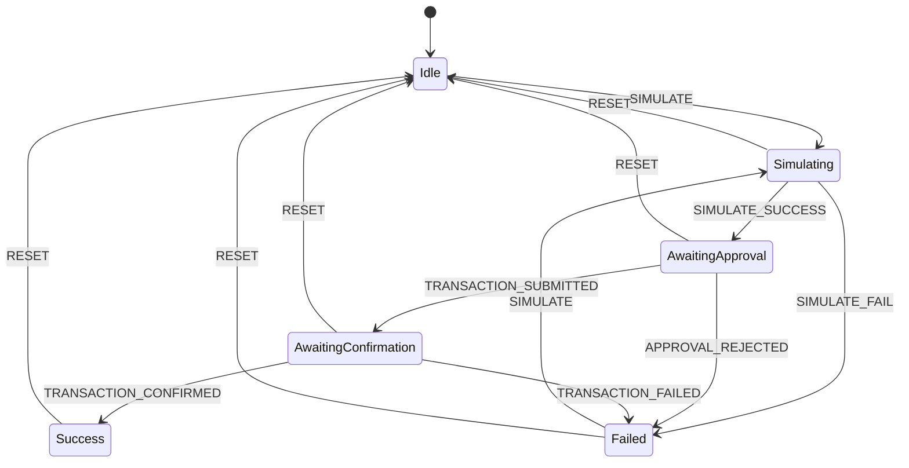

# THOUGHTS.md — nQ-Swap Frontend Assessment

## 1. Architecture Overview

The widget is a self-contained React SPA with no routing and no server. Every architectural decision was made to optimise for three properties: **correctness under failure**, **recoverability across sessions**, and **zero race conditions**.

The component tree is intentionally shallow. `SwapWidget` is the single orchestrator — it owns all swap state, coordinates between hooks, and renders the full UI. Sub-components (`TokenPanel`, `SwapArrow`, `SlippageRow`) are pure presentational components that receive props and fire callbacks. This separation means the entire business logic surface is concentrated in one place rather than scattered across a component hierarchy that would be hard to reason about during a transaction flow.

The data flow is strictly unidirectional:

```
User interaction
  → submitSwap() [useDeduplicatedSwap]
    → swapExecutor() [useCallback in SwapWidget]
      → dispatch(action) [useTransactionStateMachine]
        → React re-render
          → deriveButtonState() → UI reflects new state
```

No state escapes this loop. There are no parallel boolean flags for "is loading" or "is approved" — the state machine is the single source of truth for what is happening at any moment.

---

## 2. State Machine Rationale



A formal state machine was chosen over ad-hoc boolean flags for two reasons.

First, **illegal state combinations are impossible by construction**. With boolean flags you can have `isLoading: true` and `isSuccess: true` simultaneously — a state that should never exist but will eventually happen due to a missed edge case. Discriminated unions make this impossible at the type level.

Second, **illegal transitions throw in development**. The `VALID_TRANSITIONS` map means that if any code path tries to dispatch an action that doesn't make sense from the current state — say, `TRANSACTION_FAILED` from `Simulating` — it throws a descriptive error immediately in dev mode rather than silently producing a corrupted UI state that's impossible to debug. This caught several real bugs during development of Phases 4 through 7.

The reducer is a pure function with zero side effects. All side effects (Wagmi polling, storage writes, timeouts) live in `useEffect` watchers. This makes the reducer trivially testable — given a state and an action, the output is always deterministic.

---

## 3. Request Deduplication — Design Decisions

The core insight is that the deduplication lock must be a **ref, not state**. If we used `useState(false)` for the lock, React might batch the state update, creating a window where two concurrent calls both see `isLocked: false` before the re-render fires. A `useRef` mutation is synchronous and immediate — the first call sets `lockRef.current = true` and every subsequent synchronous or near-synchronous call sees `true` instantly.

The lock is acquired **before the first `await`**. This is the critical ordering. If we awaited anything before setting the lock, a second call could slip through in the gap between the first call starting and the first await resolving.

The 60-second timeout escape hatch exists because async flows can fail in ways that bypass our catch blocks — an unhandled promise rejection, a browser that terminates a service worker, a navigation that unmounts the component mid-flight. Without the timeout, a failed lock acquisition would permanently brick the widget until page reload. The timeout is the safety net that guarantees the widget always returns to a usable state.

The stateRef pattern in `swapExecutor` was added to solve a specific React closure bug: `useCallback` captures `state.status` at the time the callback is created. If we included `state.status` in the dependency array, the executor would be recreated on every state transition — and `useDeduplicatedSwap` would see a new executor reference mid-flight, breaking the lock. By reading from `stateRef.current` instead, we get the live value without recreating the callback.

---

## 4. Transaction Recovery — Trade-offs

**IndexedDB + localStorage dual layer**: The primary motivation for dual-layer storage is that IndexedDB is unavailable in private/incognito mode in Safari and fails under memory pressure in some mobile browsers. Writing to localStorage first (synchronous, always available) then IndexedDB (async, more capable) means recovery works even if the IndexedDB write never completes — which is exactly the scenario we're guarding against (tab close immediately after tx submission).

**30-minute TTL**: Transactions that haven't confirmed in 30 minutes are almost certainly stuck or dropped. Showing a recovery banner for a several-hour-old pending transaction would confuse users into thinking a transaction is recoverable when it's long dead. The tradeoff is that a genuinely slow transaction (e.g. extremely low gas on a congested network) might expire the recovery window. In production, the TTL should be configurable per chain.

**5-second clear delay after confirmation**: The recovery banner shows "✓ Confirmed" for 5 seconds before clearing. This is a UX decision — if we cleared storage immediately on confirmation, the banner would disappear before the user had a chance to read it, making the recovery feel broken rather than successful.

**On-mount only scan**: The recovery check runs once on mount, not on every render or on a timer. Running it more frequently would falsely trigger recovery during normal swap flows (we'd try to "recover" a transaction that's actively in-progress). The tradeoff is that if storage is written but the mount scan completes before the write (a race condition on very slow devices), recovery won't trigger. This is acceptable — the window is measured in milliseconds.

---

## 5. Animation Design Philosophy

The pending animation deliberately uses the **actual nQ-Swap logo paths** rather than a generic spinner or abstract shapes. This was a deliberate product decision: the animation should reinforce brand identity during the moment of highest user anxiety (waiting for a transaction to confirm), not introduce a new visual element.

The `strokeDashoffset` path-tracing technique was chosen because it creates a sense of **progress and momentum** without implying a specific percentage complete. A progress bar implies you know how long something will take. A spinner implies pure waiting. A path-tracing animation implies active work happening along a defined route — which is the correct mental model for a blockchain transaction.

The block-time synchronisation is the most technically interesting design decision. Rather than picking an arbitrary animation speed, the loop duration is set to the chain's average block time. On Ethereum (12s), one full trace loop represents one expected block — the animation is genuinely informative. On Arbitrum (0.25s), it spins fast, communicating that confirmation will be nearly instant. This makes the animation a data visualisation as well as a loading indicator.

The `useReducedMotion` hook respects the OS-level accessibility preference. Users who have enabled reduced motion see a static logo instead of the animation. This was non-negotiable — animations that ignore `prefers-reduced-motion` can trigger vestibular disorders.

---

## 6. Security Considerations

**No secrets in the bundle**: All RPC endpoints and the WalletConnect project ID are loaded from environment variables prefixed with `VITE_`. Vite inlines these at build time, which means they appear in the built JavaScript. This is unavoidable for client-side Web3 apps — RPC endpoints are not secrets in the traditional sense, but they are rate-limited resources. The `.env.example` documents this clearly and `.env` is gitignored.

**API key redaction in logs**: `rpcFallback.ts` redacts API keys from log output by extracting only the hostname from endpoint URLs. This prevents API keys from appearing in browser devtools or being captured by error monitoring services.

**External link safety**: Every `target="_blank"` link in the codebase uses `rel="noopener noreferrer"`. `noopener` prevents the opened tab from accessing `window.opener` (a known phishing vector). `noreferrer` prevents the destination from seeing the referring URL.

**No `any` types**: TypeScript strict mode is enabled with `noImplicitAny`. Every type is explicit. This is not just a code quality concern — `any` in a financial application means a runtime value that the type system can't verify is safe to use. A mistyped token address or amount that passes through an `any` boundary could produce a silent incorrect transaction.

**Deduplication as a security primitive**: The request deduplication lock prevents a class of user error where rapid clicking submits multiple transactions. In a real implementation with actual wallet calls, this is meaningful — submitting the same swap twice could result in the user losing funds to slippage on the second execution. The lock makes this impossible by construction.

---

## 7. What I Would Do With More Time

**Real swap routing**: The current implementation uses hardcoded mock exchange rates. A production widget would integrate with a DEX aggregator (1inch, 0x, Uniswap Universal Router) to get real quotes, real price impact, and real routing across multiple liquidity pools. The state machine and executor pattern are designed to accommodate this — the simulation step would call the aggregator's quote API, and the submission step would call their swap API.

**Token allowance flow**: ERC-20 tokens require a separate `approve()` transaction before the swap itself can execute. The current mock skips this entirely. A real implementation would check allowance on-chain during simulation and insert an approval step into the executor flow if needed. The state machine would need `AwaitingAllowanceApproval` and `AllowanceConfirmed` states.

**Price feed integration**: Real-time token prices from a Chainlink oracle or CoinGecko API would replace the hardcoded `MOCK_RATES`. This is important for price impact calculation — an incorrect rate produces an incorrect impact percentage, which could lead users to accept trades they'd reject with accurate information.

**End-to-end tests**: The state machine reducer is a pure function and would be trivially testable with Vitest. The deduplication stress test (10 rapid clicks) should be an automated test, not a manual verification step. The recovery flow (write to IndexedDB, simulate tab close, read on remount) is a perfect candidate for Playwright end-to-end tests.

**Error boundary**: The widget currently has no React error boundary. An unhandled error in a child component would crash the entire widget. A production implementation would wrap the widget in an error boundary that shows a graceful "Something went wrong" state with a reset button rather than a blank screen.

**Token list from an API**: The five hardcoded tokens should be replaced with a dynamic token list from a source like Uniswap's token list standard or CoinGecko. This would support thousands of tokens with real metadata, icons, and verification badges.

---

## 8. Trade-offs I Made Consciously

**Mock executor vs. real Wagmi `writeContract`**: The swap executor uses `setTimeout` delays and a mock transaction hash rather than real Wagmi wallet calls. This was a deliberate choice to keep the assessment focused on architecture and state management rather than on DEX contract integration, which would require a specific protocol's ABI, router address, and quote format. All the scaffolding for real wallet calls is in place — `wagmiConfig` has multi-chain transport, the state machine has the right states, and the executor signature accepts `dispatch` so it could call `writeContract` and dispatch based on the result.

**Zustand installed but unused**: Zustand is in `package.json` from Phase 1. The state management ended up being cleanly handled by `useReducer` (for the state machine) and `useState` (for UI state), which are sufficient for a single-widget app. Zustand would be the right choice if the widget needed to share state across multiple disconnected components — for example, a token price display in the header that updates when the swap widget changes the selected token.

**`idb` for IndexedDB over raw IndexedDB API**: The raw IndexedDB API is callback-based and verbose. `idb` is a tiny (< 2KB) promise-based wrapper that makes the same operations readable without adding meaningful bundle weight. The trade-off is a dependency that could theoretically become unmaintained. Given its maturity (10+ years, used by Google Chrome DevTools), this was an easy call.

**ConnectKit over RainbowKit**: Both are mature wallet connection libraries. ConnectKit has a more minimal API surface and cleaner CSS variable theming, which made it easier to match the nQ dark design language without fighting the library's default styles. RainbowKit has a wider wallet support matrix, which would matter more in a production context.

**No code splitting**: The production bundle is large (~1MB+ unminified) because wagmi, viem, and connectkit are all heavy libraries. Code splitting with dynamic `import()` would reduce initial load time significantly. The `@wagmi/core` import in `swapExecutor` is already dynamic (it only loads when the user clicks Swap), but the main bundle still loads all of wagmi upfront. For a production widget that might be embedded in a larger app, lazy-loading the entire widget would be the right approach.
